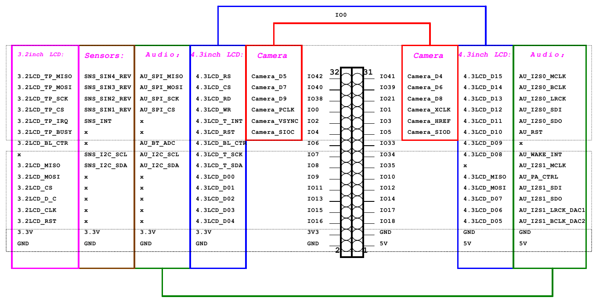

# _ESP32-S2-HMI_

_HMI evaluation suite for new low power, low cost and secure Internet of Things chip ESP32-S2. ESP32-S2 chip is equipped with Xtensa 32-bit LX7 single-core processor.
Working frequency up to 240 MHz, providing a wealth of peripheral interfaces, including SPI, I2S, UART, I2C, LED PWM, PCNT, LCD interface, Camera interface, ADC, DAC,
Touch sensors, temperature sensors and up to 43 GPIOs. Supports high-resolution LCD displays and Camera Sensor, as well as a variety of extension options.
Perfectly supports open source GUI LittleVGL, providing a large number of rich and easy-to-use GUI components and design examples._



## Contents

* Directory tree

    ```
    ├── add_path.sh
    ├── docs
    │   ├── logo.png
    │   ├── OV2640_DS+(2.2).pdf
    │   └── pin_conf.png
    ├── projects
    │   ├── hmi
    │   └── lcd_cam_loopback
    ├── README.md
    └── tools
        └── esp-idf
    ```

    * projects

      Development examples

    * tools

      * ESP32-S2 sdk

    * Data

      * Schematic diagram

      * Misc

## How to use

You can follow the steps below to set up the development environment, or directly download the release version of the full environment.

* clone

  ```bash
  git clone --recursive https://github.com/xiongyumail/esp32-s2-hmi
  cd esp32-s2-hmi
  ```

  * note

    Don't omit `--recursive`, because we use submodule.

* update

  ```bash
  git pull
  git submodule update --init --recursive
  ```

* Install toolchain

  ```bash
  ./tools/esp-idf/install.sh
  . ./tools/esp-idf/export.sh
  ```

* Add environment variables

  ```bash
  . add_path.sh
  ```
  * note

    Don't omit `"."`

## Appendix

### Schematic

### Datasheet

* [CAM-OV2640](docs/OV2640_DS+(2.2).pdf)
