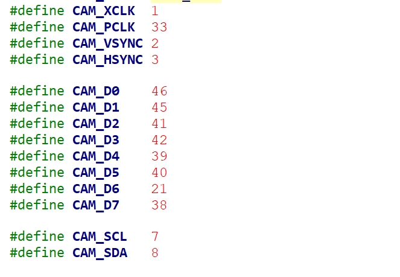

_ESP32_S2 is a new low cost, low power Internet of Things (IOT) chip with Xtensa 32-bit LX7 single-core processor with a main frequency of up to 240MHz and rich peripheral interfaces.This case USES Ai-Thinker's ESP32-S2 development board, which shows how to use the camera separately, based on the example for ESP32_S2_HMI_


## pin config


## Contents

* Directory tree

    ```
    ├── add_path.sh
    ├── docs
    │   ├── logo.png
    │   ├── OV2640_DS+(2.2).pdf
    │   └── esp32-s2pin.png
    ├── example
    │   └──s2-cam
    ├── README.md
    └── tools
        └── esp-idf
    ```

    * example

      Development examples

    * tools

      * ESP32-S2 sdk

    * Data

      * Schematic diagram

      * Misc

## How to use

You can follow the steps below to set up the development environment, or directly download the release version of the full environment.

* clone

Example of a camera

  ```bash
  git clone --recursive https://github.com/AI-Thinker-wm/esp32-s2-cam.git
  cd esp32-s2-cam
  ```
  Or an example of HMI https://github.com/xiongyumail/esp32-s2-hmi

  * note

    Don't omit `--recursive`, because we use submodule.

* update

  ```bash
  git pull
  git submodule update --init --recursive
  ```

* Install toolchain

  ```bash
  ./tools/esp-idf/install.sh
  . ./tools/esp-idf/export.sh
  ```

* Add environment variables

  ```bash
  . add_path.sh
  ```
  * note

    Don't omit `"."`

## Appendix

### Schematic

### Datasheet

* [CAM-OV2640](docs/OV2640_DS+(2.2).pdf)
