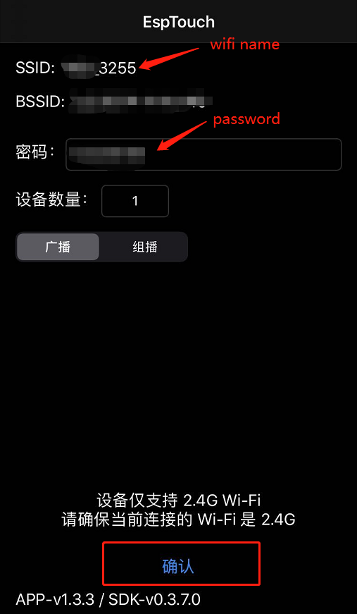

# _ESP2-S2_CAM_


## How to use

Please burn it first and connect it to the wifi router.

* Compile download

```bash
idf.py set-target esp32s2
idf.py flash
idf.py monitor
```

* Connect WiFi

Development board wiring, power on.Connect to wifi using Lexin Esptouch, enter the wifi password and click to confirm the connection, as shown in the figure below:


